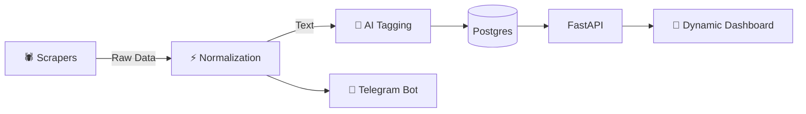

# 🛡️ CyberTracker (Agentic SecOps Platform)

> **Next-Gen Intelligence Platform** for tracking Global CTFs & Security Conferences.
> *Featuring a Dynamic Cyber-Themed Dashboard, AI-Powered Tagging, and Real-Time Alerts.*


---

## 🌌 Dynamic User Experience (yeni)

CyberTracker, sıradan bir liste görünümünün ötesine geçerek, siber güvenlik uzmanlarına **"Premium"** bir deneyim sunar.

### 🎨 Cyber Dashboard & UI
*   **Glassmorphism Estetiği:** Modern, yarı saydam kartlar ve bulanık arka plan efektleri.
*   **Canlı Animasyonlar:**
    *   🔴 **Pulse Effect**: Şu an devam eden ("Live") etkinlikler için kalp atışı animasyonu.
    *   ✨ **Hover Effects**: Kart üzerine gelindiğinde 3D derinlik ve parlama efektleri.
    *   🚀 **Smooth Transitions**: Sayfa geçişleri ve yüklemeler için akıcı animasyonlar.
*   **Karanlık Mod (Dark Mode):** Göz yormayan, odaklanmayı artıran profesyonel renk paleti.

### ⚡ İnteraktif Özellikler
*   **🌍 Çoklu Dil Desteği:** Tek tıkla **Türkçe (TR) 🇹🇷** ve **İngilizce (EN) 🇺🇸** arasında anlık geçiş.
*   **🔍 Instant Search:** Sayfa yenilemeden çalışan, nanosaniye hızında istemci taraflı arama ve filtreleme.
*   **🏷️ Smart Tagging:** AI tarafından üretilen etiketler (Örn: *#Crypto*, *#Pwn*) ile içerik keşfi.

---

## 📖 Proje Hakkında (About)

**CyberTracker**, dağınık kaynaklardan (CTFtime, RSS) veri toplayan, bunları yapay zeka ile zenginleştiren ve kullanıcıyı proaktif olarak bilgilendiren otonom bir sistemdir.

### Temel Yetenekler
1.  **Otonom Veri Toplama:** CTFtime ve Konferans kaynaklarını otomatik tarar.
2.  **AI Analizi:** Etkinlik açıklamalarını analiz edip kategorize eder.
3.  **Anlık Bildirimler:** Yeni fırsatları Telegram üzerinden haber verir.
4.  **Self-Healing:** Kendi sağlığını (`manage.py self-check`) sürekli kontrol eder.

---

## 🚀 Hızlı Başlangıç (Quick Start)

Proje **Docker** ile saniyeler içinde ayağa kalkar.

### 1. Kurulum
```bash
git clone https://github.com/your-username/CTF-Conference-Tracker.git
cd CTF-Conference-Tracker
cp .env.example .env
```

### 2. Çalıştırma (Running)

#### 🐳 Seçenek A: Docker (Önerilen)
Sistemi izole bir şekilde çalıştırmak için:
```bash
docker-compose -f deploy/docker-compose.yml up --build -d
```

#### 🐍 Seçenek B: Manuel Kurulum (Local)
Geliştirme yapmak veya Docker kullanmadan çalıştırmak için:

1. **Sanal Ortam (Opsiyonel):**
   ```bash
   python3 -m venv venv
   source venv/bin/activate  # Mac/Linux
   # venv\Scripts\activate   # Windows
   ```

2. **Bağımlılıkları Yükle:**
   ```bash
   pip install -r requirements.txt
   ```

3. **Uygulamayı Başlat:**
   ```bash
   uvicorn src.main:app --reload
   ```

### 3. Erişim
| Arayüz | URL | Özellik |
| :--- | :--- | :--- |
| **Dynamic Dashboard** | `http://localhost:8000` | 🎨 Cyber UI, Animations, TR/EN Support |
| **API Docs** | `http://localhost:8000/docs` | 📄 Swagger / OpenAPI |
| **Calendar Feed** | `http://localhost:8000/calendar/ctf.ics` | 📅 iCal Subscription |

---

## 🧠 Nasıl Çalışır? (Architecture)

Sistem **Modular Monolith** mimarisindedir ve tamamen asenkron (Async) çalışır.



---

## 📂 Proje Yapısı

*   `src/app/static/`: **Dynamic Frontend** (HTML/Alpine.js/Tailwind).
*   `src/app/workers/`: **Scrapers** (CTFtime, RSS).
*   `src/app/services/`: **Intelligence** (AI, Notifications).
*   `tests/`: **Automation** (Pytest).
*   `docs/`: **Audit & Plans**.

---

## 🤝 Katkıda Bulunma

1.  Forklayın.
2.  Feature branch oluşturun (`git checkout -b feature/dynamic-ui`).
3.  PR gönderin.

---

**Lisans:** MIT
