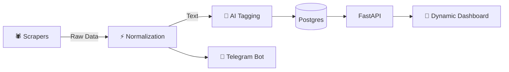

# 🛡️ CyberTracker (Agentic SecOps Platform)

> **Next-Gen Intelligence Platform** for tracking Global CTFs & Security Conferences.
> *Featuring a Dynamic Cyber-Themed Dashboard, AI-Powered Tagging, and Real-Time Alerts.*


---

## 📋 İçindekiler (Documentation Index)
1.  [Proje Hakkında](#-proje-hakkında-about)
2.  [Mimari & Teknoloji](#-nasıl-çalışır-architecture)
3.  [Hızlı Başlangıç (Kurulum)](#-hızlı-başlangıç-quick-start)
4.  [İlk Veri Yükleme](#-ilk-kurulum--veri-yükleme-first-run)
5.  [Proje Yapısı](#-proje-yapısı-project-structure)
6.  [CI/CD & Kalite](#%EF%B8%8F-cicd--kalite-quality-assurance)

7.  [Hata Bildirimi (Security)](docs/SECURITY.md)
8.  [Yol Haritası (Roadmap)](docs/ROADMAP.md)

---

## 🌌 Dynamic User Experience (yeni)

CyberTracker, sıradan bir liste görünümünün ötesine geçerek, siber güvenlik uzmanlarına **"Premium"** bir deneyim sunar.

### 🎨 Cyber Dashboard & UI
*   **Glassmorphism Estetiği:** Modern, yarı saydam kartlar ve bulanık arka plan efektleri.
*   **Canlı Animasyonlar:**
    *   🔴 **Pulse Effect**: Şu an devam eden ("Live") etkinlikler için kalp atışı animasyonu.
    *   ✨ **Hover Effects**: Kart üzerine gelindiğinde 3D derinlik ve parlama efektleri.
    *   🚀 **Smooth Transitions**: Sayfa geçişleri ve yüklemeler için akıcı animasyonlar.
*   **Karanlık Mod (Dark Mode):** Göz yormayan, odaklanmayı artıran profesyonel renk paleti.

### ⚡ İnteraktif Özellikler
*   **🌍 Çoklu Dil Desteği:** Tek tıkla **Türkçe (TR) 🇹🇷** ve **İngilizce (EN) 🇺🇸** arasında anlık geçiş.
*   **🔍 Instant Search:** Sayfa yenilemeden çalışan, nanosaniye hızında istemci taraflı arama ve filtreleme.
*   **🏷️ Smart Tagging:** AI tarafından üretilen etiketler (Örn: *#Crypto*, *#Pwn*) ile içerik keşfi.

---

## 📖 Proje Hakkında (About)

**CyberTracker**, dağınık kaynaklardan (CTFtime, RSS) veri toplayan, bunları yapay zeka ile zenginleştiren ve kullanıcıyı proaktif olarak bilgilendiren otonom bir sistemdir.

### Temel Yetenekler
1.  **Otonom Veri Toplama:** CTFtime ve Konferans kaynaklarını otomatik tarar.
2.  **AI Analizi:** Etkinlik açıklamalarını analiz edip kategorize eder.
3.  **Anlık Bildirimler:** Yeni fırsatları Telegram üzerinden haber verir.
4.  **Self-Healing:** Kendi sağlığını (`manage.py self-check`) sürekli kontrol eder.

---

## 🚀 Hızlı Başlangıç (Quick Start)

### Ön Hazırlık (Prerequisites)
*   Python 3.11+
*   Docker & Docker Compose (Önerilen)
*   PostgreSQL & Redis (Manuel kurulum için)

### 🐳 Seçenek A: Docker (Önerilen)
Proje tek komutla tüm bağımlılıklarıyla ayağa kalkar.

```bash
# 1. Projeyi klonlayın
git clone https://github.com/your-username/CTF-Conference-Tracker.git
cd CTF-Conference-Tracker

# 2. Örnek environment dosyasını kopyalayın
cp .env.example .env

# 3. Docker Compose ile başlatın
docker-compose up --build -d

# 4. Logları izleyin
docker-compose logs -f
```

### 🏁 İlk Kurulum & Veri Yükleme (First Run)
Veritabanı ilk kez oluşturulduğunda boştur. İçerikleri çekmek için şu adımları izleyin:

1.  **Tabloların Oluştuğundan Emin Olun:**
    Eğer loglarda `relation "events" does not exist` hatası görürseniz:
    ```bash
    # Migrasyon dosyasını oluştur ve uygula
    docker-compose exec backend alembic revision --autogenerate -m "Initial_tables"
    docker-compose exec backend alembic upgrade head
    ```

2.  **Verileri Çekin (Data Seeding):**
    CTFtime ve diğer kaynaklardan veri çekmek için:
    ```bash
    docker-compose exec backend python scripts/manage.py trigger_ingest
    ```
    *Bu işlem arka planda çalışır ve 1-2 dakika içinde arayüzde etkinlikler görünmeye başlar.*

### 🐍 Seçenek B: Manuel Kurulum (Local Development)

1.  **Sanal Ortam Oluşturun:**
    ```bash
    python3 -m venv venv
    source venv/bin/activate
    ```

2.  **Bağımlılıkları Yükleyin:**
    ```bash
    pip install -r requirements.txt
    ```

3.  **Çevresel Değişkenleri Ayarlayın:**
    `.env` dosyasını düzenleyin ve `SECRET_KEY`'i güncelleyin.
    ```bash
    cp .env.example .env
    ```

4.  **Veritabanı Migrasyonlarını Çalıştırın:**
    ```bash
    alembic upgrade head
    ```

5.  **Uygulamayı Başlatın:**
    ```bash
    uvicorn src.main:app --reload
    ```

### 🧪 Testleri Çalıştırma (Running Tests)
Unit testler `pytest` ile koşturulur.
```bash
pytest
```

### 🛡️ Diğer Komutlar
*   **Linting:** `ruff check .`
*   **Security Audit:** `bandit -r src` ve `pip-audit`
*   **Migrations:** `alembic revision --autogenerate -m "mesaj"`

### 📂 Proje Yapısı (Project Structure)
```
.
├── .github/            # CI/CD Workflows
├── alembic/            # Database Migrations
├── deploy/             # Deployment Configs
├── docs/               # Architecture & Plans
├── researches/         # Deep Research (AI Agents)
├── scripts/            # Helper Scripts
├── src/
│   ├── app/
│   │   ├── api/        # REST Endpoints
│   │   ├── core/       # Config & Security
│   │   ├── db/         # Models & Sessions
│   │   ├── services/   # Business Logic
│   │   └── workers/    # Background Tasks
│   └── main.py         # App Entrypoint
├── tests/              # Unit Tests
├── .dockerignore       # Docker Build Exclusion
├── .env.example        # Env Template
├── docker-compose.yml  # Docker Orchestration
├── Dockerfile          # App Container
└── requirements.txt    # Pinned Dependencies
```

---

## 🧠 Nasıl Çalışır? (Architecture)

Sistem **Modular Monolith** mimarisindedir ve tamamen asenkron (Async) çalışır.



---

## 📂 Proje Yapısı

*   `src/app/static/`: **Dynamic Frontend** (HTML/Alpine.js/Tailwind).
*   `src/app/workers/`: **Scrapers** (CTFtime, RSS).
*   `src/app/services/`: **Intelligence** (AI, Notifications).
*   `tests/`: **Automation** (Pytest).
*   `docs/`: **Audit & Plans**.

---

## 🛡️ CI/CD & Kalite (Quality Assurance)

Proje, yazılım kalitesini ve güvenliğini korumak için **GitHub Actions** üzerinde çalışan otomatik bir pipeline'a sahiptir.

*   **Workflow:** `.github/workflows/ci.yml` her `push` ve `pull_request` işleminde tetiklenir.
*   **Otomatik Kontroller:**
    *   ✨ **Linting & Formatting:** `ruff` kullanılarak Python kod standartları ve biçimlendirmesi denetlenir.
    *   🔒 **Güvenlik (Security):**
        *   `bandit`: Kaynak kodundaki potansiyel güvenlik açıklarını (hardcoded secrets, unsafe functions) tarar.
        *   `pip-audit`: Bağımlılık paketlerindeki bilinen zafiyetleri (CVE) kontrol eder.
    *   🧪 **Otomasyon Testleri:** `pytest` ile birim testler koşturulur.

---

## 🤝 Katkıda Bulunma

1.  Forklayın.
2.  Feature branch oluşturun (`git checkout -b feature/dynamic-ui`).
3.  PR gönderin.

---

**Lisans:** MIT
